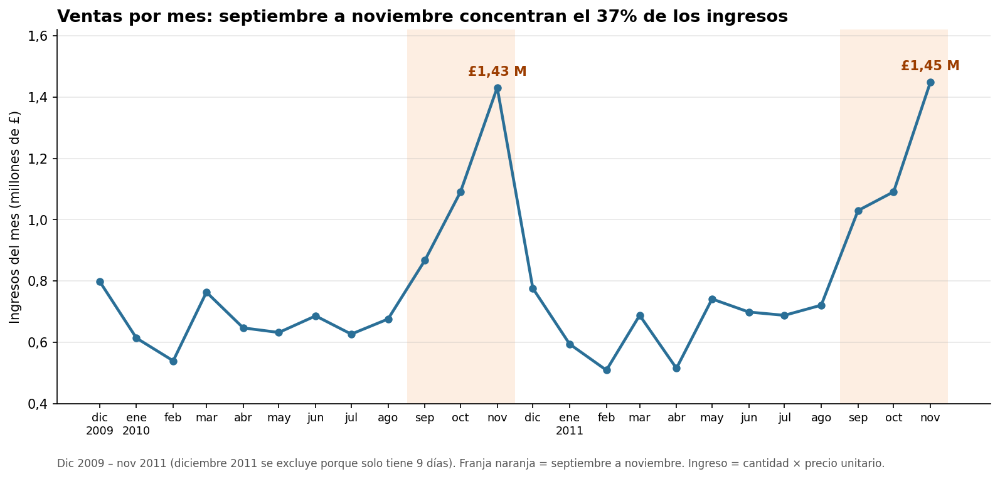
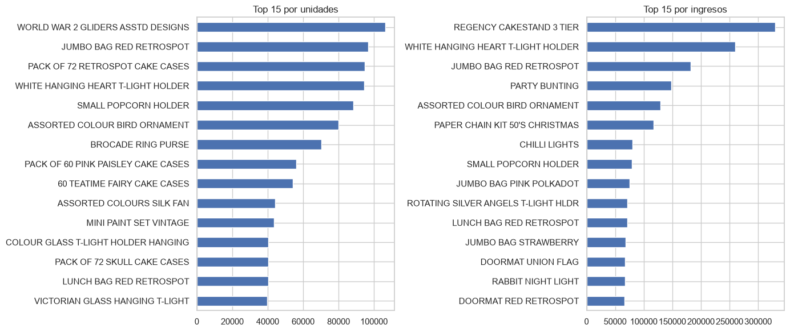

# Asistente de regalos para e-commerce

Proyecto Final Henry · Presente Analytics

Asistente que, a partir de un cuestionario de 5 preguntas, sugiere regalos individuales y combos dentro del presupuesto, usando modelos de recomendación entrenados con compras reales (Online Retail II).

## Equipo y roles

Marco Scrum y metodología CRISP-DM. Los roles son formales, para la documentación del PF: todos programamos y aportamos por igual a todo el proyecto.

| Integrante | Rol formal | Aporte adicional | Frente técnico |
| --- | --- | --- | --- |
| Franco | Product Owner | Visualización y dashboards | Modelado |
| Mafe | Scrum Master | Visualización y dashboards | Demo en Streamlit y README |
| Cristian | Liderazgo técnico (Data Team) | Visualización | EDA y Power BI |
| Ezequiel | Liderazgo técnico (Data Team) | Documentación y Git | Modelado |
| Mauricio | Liderazgo técnico (Data Team) | Documentación y Git | Ingeniería de datos |

## Cómo correr el proyecto

**Versión de Python:** 3.11 (la misma que usa la CI del repositorio, en `.github/workflows/ci.yml`).

**Instalar dependencias:**

```bash
pip install -r requirements.txt
```

**Generar los datasets limpios** (el Excel original no se sube al repo — colocalo en `data/raw/online_retail_II.xlsx` antes de correr esto):

```bash
python -m src.data.clean
```

Genera `data/processed/online_retail_rfm.parquet` y `data/processed/online_retail_modelo.parquet`.

**Generar las categorías de producto:**

```bash
python -m src.features.build_features
```

Pendiente de completar: comando para abrir la demo en Streamlit (Mafe).

## 1. Calidad de datos (Mauricio)

**Dataset:** [Online Retail II](https://archive.ics.uci.edu/dataset/502/online+retail+ii) (UCI, Chen 2012) — 1.067.371 filas, 2009-2011.

**Problemas encontrados y cómo se trataron:**

| Filtro | Filas antes | Filas después | Qué saca |
| --- | --- | --- | --- |
| Solapamiento entre hojas del Excel | 1.067.371 | 1.044.848 | 1.088 facturas de diciembre 2010 duplicadas entre las 2 hojas del archivo original |
| Compras con cancelación exacta | 1.044.848 | 1.043.498 | Compras que en realidad nunca se concretaron: mismo cliente, producto y cantidad que una cancelación dentro de las 6 horas siguientes |
| Cancelaciones | 1.043.498 | 1.024.333 | Facturas que empiezan con "C" |
| Cantidad y precio > 0 | 1.024.333 | 1.018.304 | Incluye ajustes contables (ej. stock_code "B" = deuda incobrable) y pérdidas de depósito ("lost", "damages") |
| Códigos no-producto | 1.018.304 | 1.013.814 | POST, DOT, M, BANK CHARGES, AMAZONFEE, CRUK, B, ADJUST, ADJUST2, D, C2, 23444, 23574, S, TEST001, TEST002 |
| Duplicados | 1.013.814 | 991.648 | Se agrupan y **suman** cantidades (no se descartan filas: evita perder unidades reales) |
| Descripción vacía | 991.648 | 991.648 | — |
| Con cliente identificado (según el dataset de salida) | 991.648 | 764.946 | Solo aplica al dataset de RFM, ver abajo |

**Decisiones clave:**

- **Dos datasets de salida**, no uno: `online_retail_rfm.parquet` (764.946 filas, exige cliente — para RFM y segmentación) y `online_retail_modelo.parquet` (991.648 filas, conserva ventas sin cliente — el modelo de recomendación no necesita saber quién compró).
- **Formato Parquet, no CSV:** en las pruebas de lectura del equipo, CSV no conservó los tipos esperados (`invoice_date` volvió a ser texto y `customer_id` se leyó como `13085.0`). Parquet conserva los tipos de datos.
- **El Excel trae las 2 hojas con un solapamiento real** (1.088 facturas de diciembre 2010 duplicadas entre ambas). Se detecta y saca antes de unirlas, para no contarlas dos veces.
- **Segmentación mayorista/minorista:** percentil 95 de unidades totales compradas por cliente.
- **Códigos `GIFT_` y `PADS` se conservan**, pese a precio cero o casi nulo: tienen descripción de producto real (vales de regalo con monto, "PADS TO MATCH ALL CUSHIONS"), a diferencia de los códigos administrativos excluidos (POST, D, M, etc.), que no describen ningún producto.
- **Facturas "bulk" (posible reposición al por mayor):** marcadas con una columna (`factura_bulk`), no eliminadas del dataset general. La decisión de excluirlas o no del modelo de recomendación se evalúa en Modelado, comparando métricas con y sin ellas.

**Código:** `src/data/clean.py`

**Tests:** `tests/test_clean.py` (10/10 pasando, según la entrega de calidad de datos).

**Detalle completo:** `notebooks/01_calidad_datos.ipynb`

Pendiente de completar: instrucciones para generar y cargar los dos archivos Parquet. Los datasets no se suben al repositorio.

## 2. Categorías e intereses (Mauricio)

### Categorías de producto

Se generan 28 categorías desde `description` (TF-IDF + K-Means), con cada decisión (K, bigramas) comparada en vivo contra alternativas antes de elegirse. No hay un K matemáticamente óptimo: Elbow y Silhouette no marcan un punto de corte claro; se elige por practicidad de formulario.

El 26,6% del catálogo sin vocabulario distintivo queda bajo "Variedad / Sorpresa", considerada una categoría de negocio válida.

**Código:** `src/features/build_features.py`

**Cómo generarlo:** `python -m src.features.build_features` (desde la raíz del repo) — no `python src/features/build_features.py` a secas, porque ese import relativo necesita que Python lo trate como parte del paquete `src`.

**Tests:** `tests/test_build_features.py` (8/8 pasando, según la entrega de categorías).

**Detalle:** `notebooks/02b_categorias.ipynb`

**Salida:** `data/processed/catalogo_categorizado.parquet` (28 categorías, no se sube al repo).

**Modelos congelados:** `data/processed/modelos_categorias.pkl` (no se sube al repo) — vectorizer y K-Means ya entrenados. Productos nuevos se categorizan con `categorizar_productos_nuevos()` sin re-entrenar todo el catálogo, evitando que el número de cada cluster se mueva.

Pendiente de completar: relación entre las categorías del catálogo y los intereses del cuestionario.

## 3. EDA y visualizaciones (Cristian)

Análisis exploratorio completo en [`notebooks/03_EDA.ipynb`](notebooks/03_EDA.ipynb), con un resumen en [`README_EDA.md`](README_EDA.md). Los gráficos están en `reports/figures/`; el dashboard de Power BI queda para la presentación final.

Datos: Online Retail II (diciembre 2009 a diciembre 2011), 991.648 filas y 39.402 facturas. Cifras en libras (£); ingreso = cantidad × precio unitario.

### Gráficos



*Septiembre a noviembre se destacan en los dos años. Diciembre 2011 se excluye porque solo tiene 9 días de datos.*



*Los productos más vendidos por unidades no son los que más facturan: WORLD WAR 2 GLIDERS lidera en unidades (106.331) y REGENCY CAKESTAND 3 TIER en ingresos (£329.342).*

### Tres hallazgos

1. **Las ventas se concentran entre septiembre y noviembre:** esos tres meses suman el **37% de los ingresos** de los dos años (36% y 38% en cada año), y noviembre llega a £1,43 M y £1,45 M, más del doble de un mes típico (£0,68 M) → el asistente tiene en cuenta la época del año y prioriza lo navideño desde septiembre.

2. **Pocos clientes concentran el volumen:** el 5% de los clientes (293) compra el **53,5% de las unidades** → el asistente no puede guiarse solo por lo más comprado en total, y se evalúa recomendar únicamente productos que también compran clientes minoristas.

3. **Productos baratos y pedidos de varios productos:** el producto típico cuesta **£2,10** (3 de cada 4 cuestan £4,25 o menos) y un pedido típico lleva **15 productos distintos** → el asistente trabaja con presupuestos bajos por producto y puede sugerir varios productos (combos) dentro de un mismo presupuesto.


## 4. Modelos (Ezequiel y Franco)

Pendiente de completar: baseline, KNN item-item y SVD; métricas (Hit Rate@5, NDCG@5) y tabla comparativa.

## 5. Justificación del modelo y plan de validación (Franco)

Pendiente de completar: por qué se eligió el modelo final y cómo se valida.

## 6. Demo en Streamlit (Mafe)

Pendiente de completar: qué hace cada pantalla, cómo se usa y el link público.

## 7. Pipeline reproducible y monitoreo (Mauricio)

Pendiente de completar: GitHub Actions, MLflow y cómo se reevalúa el modelo.

## Limitaciones

Pendiente de completar: qué no cubre este prototipo.
